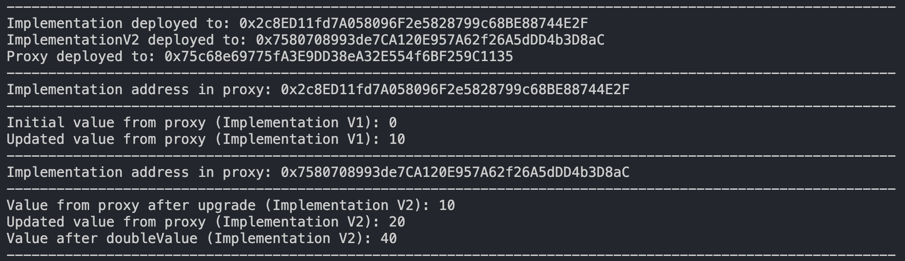

# Transparent Upgradeable Proxy Contract

This project demonstrates the implementation of a transparent upgradeable proxy pattern in Solidity, allowing the use of upgradeable smart contracts while maintaining the same address for end users. The proxy delegates calls to the implementation contracts, enabling the functionality to be upgraded seamlessly.

## Features

- **Transparent Upgradeable Proxy**: The proxy contract can delegate calls to implementation contracts and allows upgrades only by the admin.
- **Implementation Contracts**: Two versions of an implementation contract demonstrate how to change logic while preserving state.
- **State Management**: The contract stores an internal state variable that can be manipulated through the implementation contracts.
- **Upgrade Mechanism**: The proxy can be upgraded to a new implementation contract, allowing for added features without changing the contract address.

## Contracts

### 1. TransparentUpgradeableProxy.sol

This contract serves as the proxy that delegates calls to the current implementation. It stores the addresses of the implementation and admin in specific storage slots to ensure they can be modified securely.

### 2. Implementation.sol

This is the first version of the implementation contract, which includes a state variable and functions to set and get this value.

### 3. ImplementationV2.sol

This contract extends the first implementation and introduces a new function that doubles the existing value.

## Deployment Script

The deployment script written in JavaScript deploys the implementation contracts and the proxy. It also demonstrates how to interact with the contracts before and after an upgrade.

## Getting Started

1. Clone the repository:
   ```bash
   git clone https://github.com/your-username/your-repo-name.git
   cd your-repo-name
	 ```

2. Install the dependencies:
   ```bash
   npm install
	 ```

3. Start a Hardhat node:
   ```bash
   npx hardhat node
	 ```

4. Run the deployment script:
   ```bash
   npx hardhat run scripts/deploy.js --network localhost
	 ```

